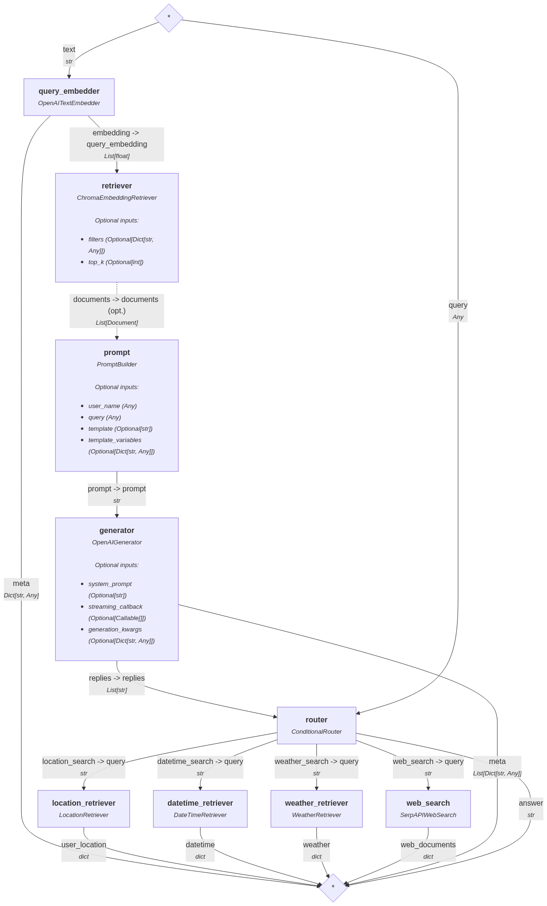

# PerceptoAI - Smart AI Assistant

PerceptoAI is a smart AI assistant powered by a Raspberry Pi that uses voice input and output for natural conversation.

## Features

### Core AI Capabilities
- Voice-to-text transcription using Speech-to-Text API
- Context-aware responses using OpenAI API
- Text-to-speech conversion for AI responses

### Context and Information Retrieval
- **Location** tool with Google Maps and OpenStreetMap integration for accurate location information
- **Date and Time** tool for accurate time zones and date
- **Weather** tool providing real-time location-based weather information
- **Web Search** tool for internet search and context-aware information gathering

### Data Management and Infrastructure
- Local conversation storage with SQLite
- Vector-based memory storage using ChromaDB
- Conversations clustering and summarization
- FastAPI backend service

## RAG Pipeline:


## Setup

1. Install dependencies:
```bash
pip install -r requirements.txt
```

2. Fill in your API keys in `.env` :
```bash
echo "OPENAI_API_KEY=<openai_api_key>" >> .env
```
```bash
echo "GOOGLE_MAPS_API_KEY=<google_maps_api_key>" >> .env
```
```bash
echo "SERP_API_KEY=<serp_api_key>" >> .env
```
```bash
echo "WEATHER_API_KEY=<weather_api_key>" >> .env
```

3. Add user facts to ChromaDB:
```bash
python add_user_facts.py
```

4. Run the FastAPI server:
```bash
uvicorn main:app --host 0.0.0.0 --port 8000
```

5. Test the API:
```bash
python process_audio.py
```


## API Endpoints

- GET `/`: Returns a message that server is running

- POST `/process_audio`: Process audio input and get AI response
  - Accepts: Audio file (any format), new conversation creation flag, speaker voice to use for the response
  - Returns: Transcription, Prompt type, AI response, and audio response

## Project Structure

### Directories:
- `data/`: Directory for storing data files
  - `databases/`: Directory for storing database files
  - `audio_prompts/`: Directory for storing audio prompts
  - `model_outputs/`: Directory for storing generated audio responses

### Files:
#### ➡️ Main App:
- `main.py`: FastAPI application with RAG pipeline
  
#### ➡️ RAG:
- `rag_config.py`: RAG pipeline configuration
- `custom_components.py`: Custom components for RAG pipeline
- `summarizer.py`: Conversation summarizer
- `rag_pipeline.py`: RAG pipeline

#### ➡️ Scripts:
- `record.py`: Recording script saving an audio file
- `add_user_facts.py`: Script for adding user facts to ChromaDB
- `process_audio.py`: Audio processing script by sending audio to endpoint

#### ➡️ Services:
- `services.py`: Audio processing services
- `database.py`: SQLite and ChromaDB databases operations


## Technologies

- **OpenAI API**: For embeddings and responses generation 
- **FastAPI**: Web framework
- **Haystack**: For RAG pipeline implementation
- **ChromaDB**: Vector database for memory storage
- **SQLite**: Local database for conversation history
- **SoundDevice**: Audio input recording
- **Whisper**: Speech-to-text transcription
- **ElevenLabs**: Text-to-speech conversion
- **Google Maps & Nominatim**: For location retrieval
- **WeatherAPI**: For weather and date-time retrievals
- **SerpAPI**: For web-based search and retrieval
