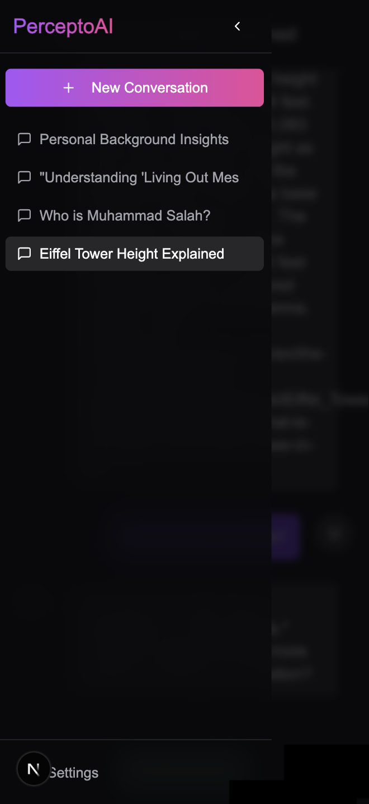
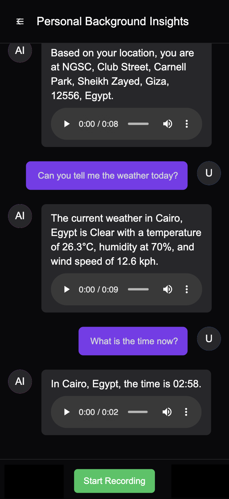

# PerceptoAI - Your Intelligent Voice Assistant

PerceptoAI is an advanced AI assistant designed for natural and intuitive voice-based interaction. Leveraging a robust RAG (Retrieval-Augmented Generation) pipeline, it offers real-time conversational capabilities, context-aware responses, and seamless integration with various external tools.

## Project Preview
<div style="display: flex; justify-content: center; flex-wrap: wrap; gap: 10px;">
  
  
  
  
  
</div>

## Key Features

### Conversational AI
- **Voice-to-Text Transcription**: Utilizes state-of-the-art Speech-to-Text APIs for accurate conversion of spoken input into text.
- **Context-Aware Responses**: Powered by OpenAI's language models to generate intelligent, contextually relevant, and natural-sounding AI responses.
- **Text-to-Speech Synthesis**: Converts AI-generated text responses back into natural-sounding speech for an immersive conversational experience.

### Enhanced Information Retrieval & Tool Integration
- **Dynamic Location Services**: Integrates with Google Maps and OpenStreetMap to provide precise, real-time location information.
- **Accurate Date & Time Management**: Offers accurate time zone and date information through dedicated tools.
- **Real-time Weather Updates**: Delivers current and forecasted weather conditions based on location.
- **Comprehensive Web Search**: Leverages web search capabilities for broad information gathering and to augment conversational context.

### Data Management & Backend Infrastructure
- **Secure Local Conversation Storage**: Stores conversation history efficiently using SQLite.
- **Intelligent Memory Management**: Employs ChromaDB for vector-based memory storage, enabling the AI to recall and utilize past conversation context.
- **Automated Conversation Summarization**: Clusters and summarizes past conversations to maintain long-term memory and facilitate concise recall.
- **High-Performance Backend**: Built with FastAPI to provide a scalable and efficient API service.

## Architecture: Retrieval-Augmented Generation (RAG) Pipeline
PerceptoAI utilizes a RAG pipeline to enhance the quality and relevance of its responses. This architecture combines the power of large language models with a robust retrieval mechanism, allowing the AI to fetch information from external sources (like its memory and web searches) before generating a response, thereby providing more accurate and informed answers.


## Getting Started

Follow these steps to set up and run PerceptoAI on your local machine.

### Prerequisites
- Python 3.8+
- Node.js (LTS recommended)
- npm or yarn

### Installation

1.  **Clone the repository:**
    ```bash
    git clone https://github.com/your-repo/PerceptoAI.git
    cd PerceptoAI
    ```

2.  **Backend Setup:**
    a.  **Create a Python virtual environment (recommended):**
    ```bash
    python3 -m venv env
    source env/bin/activate
    ```
    b.  **Install Python dependencies:**
    ```bash
    pip install -r requirements.txt
    ```
    c.  **Configure API Keys:**
    Create a `.env` file in the root directory and add your API keys:
    ```
    OPENAI_API_KEY=<your_openai_api_key>

    GOOGLE_MAPS_API_KEY=<your_google_maps_api_key>

    SERP_API_KEY=<your_serp_api_key>

    WEATHER_API_KEY=<your_weather_api_key>

    ELEVEN_LABS_API_KEY=<your_elevenlabs_api_key>
    ```
    *Note: Replace `<your_api_key>` with your actual keys.*

    d.  **Add Initial User Facts to ChromaDB (Optional but Recommended):**
    ```bash
    python backend/add_user_facts.py
    ```

    e.  **Run the FastAPI Backend Server:**
    ```bash
    uvicorn main:app --host 0.0.0.0 --port 8000
    ```
    The backend server will be running on `http://localhost:8000`.

3.  **Frontend Setup:**
    PerceptoAI's frontend is built as a Progressive Web Application (PWA) using Next.js and Tailwind CSS, designed with a mobile-first approach to provide a seamless experience across devices.
    *The frontend is built with Next.js and Tailwind CSS. If you don't have Next.js and Tailwind CSS installed, you can install them using the following commands:*
    ```bash
    npm install -g create-next-app
    npx create-next-app@latest frontend
    cd frontend
    npm install
    ```
    a.  **Navigate to the frontend directory:**
    ```bash
    cd frontend
    ```
      b.  **Install Node.js dependencies:**
      ```bash
      npm install
      # or yarn install
      ```
      c.  **Configure Frontend Environment Variables:**
      Create a `.env` file in the `frontend/` directory and add the backendAPI URL:
      ```
      NEXT_PUBLIC_API_URL=http://localhost:8000
      ```
      d.  **Run the Next.js Frontend Development Server:**
      ```bash
      npm run dev
      # or yarn dev
      ```
      The frontend application will be accessible at `http://localhost:XXXX`.

## API Endpoints

PerceptoAI exposes the following API endpoints:

### GET Endpoints
-   **GET `/`**: Checks backend server status.
-   **GET `/voice`**: Retrieves current AI voice.
-   **GET `/conversations`**: Retrieves all conversations.
-   **GET `/conversations/{conversation_id}`**: Retrieves messages for a specific conversation.

### POST Endpoints
-   **POST `/process_audio`**: Processes audio input, transcribes, generates AI response, and converts to speech.
-   **POST `/conversations`**: Creates a new conversation.

### PUT Endpoints
-   **PUT `/voice`**: Updates AI voice.

## Project Structure

```
PerceptoAI/
├── assets/
│   └── pipeline.png               # Diagram of the RAG pipeline
├── backend/
│   ├── add_user_facts.py          # Script to pre-populate ChromaDB with user-specific facts
│   ├── custom_components.py       # Custom Haystack components for RAG pipeline
│   ├── database.py                # Database operations (SQLite for conversation history)
│   ├── process_audio.py           # Script for processing audio input (for testing/development)
│   ├── rag_config.py              # Configuration for the RAG pipeline
│   ├── rag_pipeline.py            # Core RAG pipeline implementation
│   ├── record_audio.py            # Utility for recording audio (for testing/development)
│   ├── services.py                # Backend services including audio processing and conversation management
│   ├── summarizer.py              # Module for summarizing and clustering conversations
│   └── main.py                    # Main FastAPI application entry point
├── config/
│   └── elevenlabs_voice_config.py # Configuration for ElevenLabs voice IDs and tone settings
├── data/
│   └── databases/
│       ├── chroma_db/             # Directory for ChromaDB persistent storage
│       └── conversations.db       # SqlAlchemy database for conversations history
├── frontend/
│   ├── app/                       # Next.js application pages and routes
│   ├── components/                # Reusable React components (UI, conversation view, message items)
│   ├── hooks/                     # Custom React hooks
│   ├── lib/                       # Utility functions, types, and mock data
│   ├── public/                    # Static assets (images, icons, manifest, pre-recorded voices)
│   ├── styles/                    # Global CSS styles
│   └── package.json               # Frontend dependencies and scripts
├── main.py                        # Top-level entry point for the FastAPI application
├── README.md                      # Project README file
└── requirements.txt               # Python dependencies
```

## Technologies Used

-   **OpenAI API**: Utilized for generating embeddings and powerful AI responses.
-   **FastAPI**: A modern, fast (high-performance) web framework for building APIs.
-   **Haystack**: An open-source NLP framework used for building robust Retrieval-Augmented Generation (RAG) pipelines.
-   **ChromaDB**: An open-source embedding database, serving as the vector store for intelligent memory management.
-   **SQLAlchemy**: A Python SQL toolkit and Object-Relational Mapper (ORM) used for database interactions.
-   **Whisper (via OpenAI API)**: Advanced speech-to-text model for accurate audio transcription.
-   **ElevenLabs**: AI voice synthesis platform used for generating natural-sounding text-to-speech responses.
-   **Google Maps & Nominatim (OpenStreetMap)**: Integrated for precise location data retrieval.
-   **WeatherAPI**: Provides real-time weather information and date-time data.
-   **SerpAPI**: Powers web-based search capabilities for comprehensive information retrieval.
-   **Next.js**: A React framework for building server-side rendered and static web applications, used for the frontend.
-   **Tailwind CSS**: A utility-first CSS framework for rapidly building custom user interfaces.

## Contributing

We welcome contributions! Please feel free to fork the repository and submit a pull request.
